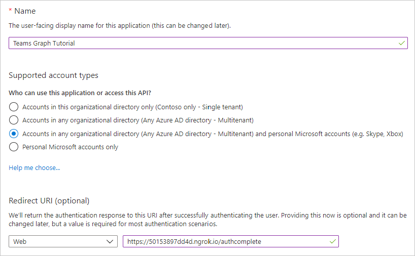
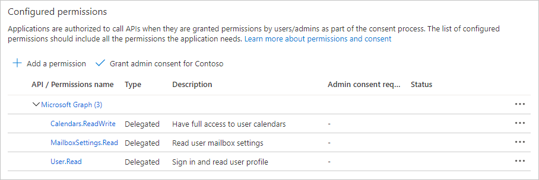

<!-- markdownlint-disable MD002 MD041 -->

In dieser Übung erstellen Sie mithilfe des Azure Active Directory Admin Center eine neue Azure AD-Webanwendungs Registrierung.

1. Öffnen Sie einen Browser, und navigieren Sie zum [Azure Active Directory Admin Center](https://aad.portal.azure.com). Melden Sie sich mit einem **persönlichen Konto** (auch: Microsoft-Konto) oder einem **Geschäfts- oder Schulkonto** an.

1. Wählen Sie in der linken Navigationsleiste **Azure Active Directory** aus, und wählen Sie dann **App-Registrierungen** unter **Verwalten** aus.

    

1. Wählen Sie **Neue Registrierung** aus. Legen Sie auf der Seite **Anwendung registrieren** die Werte wie folgt fest, wobei `YOUR_NGROK_URL` es sich um die ngrok-Weiterleitungs-URL handelt, die Sie im vorherigen Abschnitt kopiert haben.

    - Legen Sie **Name** auf `Teams Graph Tutorial` fest.
    - Legen Sie **Unterstützte Kontotypen** auf **Konten in allen Organisationsverzeichnissen und persönliche Microsoft-Konten** fest.
    - Legen Sie unter **Umleitungs-URI** die erste Dropdownoption auf `Web` fest, und legen Sie den Wert auf `YOUR_NGROK_URL/authcomplete` fest.

    

1. Wählen Sie **Registrieren** aus. Kopieren Sie auf der Seite Microsoft **Teams Graph Tutorial** den Wert der **Anwendungs-ID (Client)** , und speichern Sie ihn, und Sie benötigen ihn im nächsten Schritt.

    

1. Wählen Sie unter **Verwalten** die Option **Authentifizierung** aus. Suchen Sie den **impliziten Grant** -Abschnitt, und aktivieren Sie **Zugriffstoken** und **ID-Token**. Klicken Sie auf **Speichern**.

1. Wählen Sie unter **Verwalten** die Option **Zertifikate und Geheime Clientschlüssel** aus. Wählen Sie die Schaltfläche **Neuen geheimen Clientschlüssel** aus. Geben Sie einen Wert in **Beschreibung** ein, wählen Sie eine der Optionen für **Gilt bis** aus, und wählen Sie dann **Hinzufügen** aus.

1. Kopieren Sie den Wert des geheimen Clientschlüssels, bevor Sie diese Seite verlassen. Sie benötigen ihn im nächsten Schritt.

    > [!IMPORTANT]
    > Dieser geheime Clientschlüssel wird nicht noch einmal angezeigt, stellen Sie daher sicher, dass Sie ihn jetzt kopieren.

1. Wählen Sie unter **Manage** die **API-Berechtigungen** aus, und wählen Sie dann **Berechtigung hinzufügen** aus.

1. Wählen Sie **Microsoft Graph** und dann **Delegierte Berechtigungen** aus.

1. Wählen Sie die folgenden Berechtigungen aus, und wählen Sie dann **Berechtigungen hinzufügen** aus.

    - **Calendars. ReadWrite** : Dadurch kann die APP den Kalender des Benutzers lesen und schreiben.
    - **Mailbox Settings. Read** – dadurch kann die APP die Zeitzone des Benutzers, das Datumsformat und das Zeitformat aus seinen Postfacheinstellungen abrufen.

    

## Konfigurieren von Teams für einmaliges Anmelden

In diesem Abschnitt aktualisieren Sie die APP-Registrierung, um das [einmalige Anmelden in Microsoft Teams](/microsoftteams/platform/tabs/how-to/authentication/auth-aad-sso)zu unterstützen.

1. Wählen Sie **eine API verfügbar machen** aus. Wählen Sie neben **Anwendungs-ID-URI** den Link **festlegen** aus. Fügen Sie den Domänennamen ngrok Forwarding URL (mit einem Schrägstrich "/" am Ende) zwischen den doppelten Schrägstrichen und der GUID ein. Die gesamte ID sollte wie folgt aussehen: `api://50153897dd4d.ngrok.io/ae7d8088-3422-4c8c-a351-6ded0f21d615` .

1. Wählen Sie im Abschnitt **durch diese API definierte Bereiche** die Option **Bereich hinzufügen** aus. Füllen Sie die Felder wie folgt aus, und wählen Sie **Bereich hinzufügen** aus.

    - **Bereichsname:**`access_as_user`
    - **Wer kann zustimmen?: Administratoren und Benutzer**
    - **Anzeigename der Administrator Zustimmung:**`Access the app as the user`
    - **Beschreibung der Administrator Zustimmung:**`Allows Teams to call the app's web APIs as the current user.`
    - **Anzeigename der Benutzer Zustimmung:**`Access the app as you`
    - **Beschreibung der Benutzer Zustimmung:**`Allows Teams to call the app's web APIs as you.`
    - **Status: aktiviert**

    

1. Wählen Sie im Abschnitt **autorisierte Clientanwendungen** die Option **Clientanwendung hinzufügen** aus. Geben Sie eine Client-ID aus der folgenden Liste ein, aktivieren Sie den Bereich unter **autorisierte Bereiche**, und wählen Sie **Anwendung hinzufügen** aus. Wiederholen Sie diesen Vorgang für jede der Client-IDs in der Liste.

    - `1fec8e78-bce4-4aaf-ab1b-5451cc387264` (Mobile Teams/Desktopanwendung)
    - `5e3ce6c0-2b1f-4285-8d4b-75ee78787346` (Microsoft Teams-Webanwendung)
